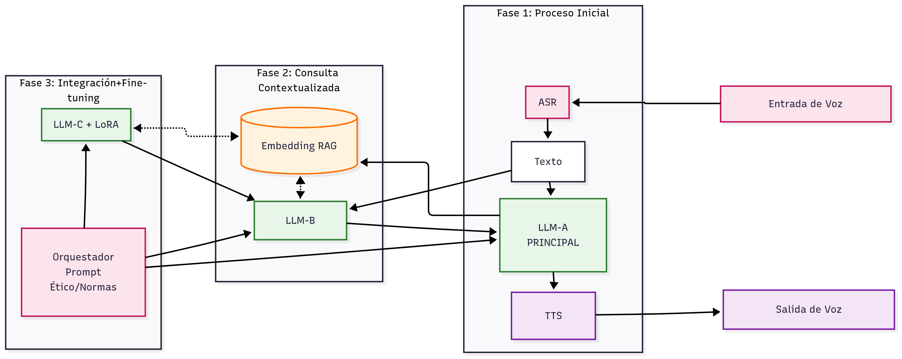

# EndLessMemory
Es una IA Multimodal que busca completar lo que le falta a cualquier asistente actual. La razón de ser de **EndLessMemory** es empatizar más a nivel personal con cada persona. Es una IA que puede acordarse de **TODAS** las conversaciones de forma personalizada, ética, local y **SEGURA**.

Con cada interacción **EndLessMemory** no solo busca acordarse de lo hablado, si no de empatizar, y adaptarse a las necesidades que cada uno de nosotros tenemos de forma individualizada por natruraleza.

Si el usuario final desease que su **EndLessMemory** permaneciese vivo a título postumo. Podría clonar la voz, imágen, ideas, historias y acercarse a la esencia de todo aquello que se compartiera. 

**EndLessMemory** entre **otras facetas** está especialmente pensado para:
- Personas con Alzheimer que quieran conservar su **esencia**
- Personas mayores o que precisen compañia
- Sobre todo, para todos aquellos que interactuamos con agentes de IA. Y que notamos que no hay una continuidad en nuestras conversaciones. Requerimos de un apoyo más humano a largo plazo, pero con los conocimientos y aptitudes de una IA. 

**EndLessMemory** nos proporciona poder seguir conversaciones e interactuar con situaciones actuales, historias comentadas en el pasado. O simplemente contar ideas de necesidades personales, de proyectos de trabajo, etc.. **EndLessMemory**  es como una **caja negra** de tus propias necesidades y conocimientos adquiridos a lo **largo del tiempo**. 

# Sistema de IA Multimodal

  

Es un Sistema avanzado de IA multimodal que procesa entradas de voz, y video a la vez que genera respuestas contextuales aprendiendo continuamente de cada interacción. Combina modelos de lenguaje grandes (LLM) con otros multiples modelos ASR,VLM, multiples LLMs más pequeños, TTS, etc.. con recuperación aumentada de generación (RAG) y fine-tuning mediante LoRA para crear una experiencia conversacional enriquecida y ética.

El sistema está pensado para **evolucionar** con  aquitecturas o tecnologías futuras. Para ello, hay que pensar que cada persona habla al día unas 16.000 a 20.000 palabras y escucha al menos el doble de ellas cada día. 
En una vida de unos 80 años, estaríamos hablando que si almacenásemos todas las palabras habladas y escuchadas (sin contar compresion y metadatos necesarios) haría falta solamente unos 9Gb de información vital. Independientemente al modelo que se usase de **EndLessMemory** actual o futuro. Por lo que teniendo en cuenta que la IA ha venido para quedarse. Es mejor unir recursos para encaminarnos hacia un camino más fácil y una interacción más humana.

##  Etapa 1: Características Principales

- **Procesamiento multimodal**: Entrada de voz y mediante una LLM grande salida de texto y voz
- **Memoria infinita**: Sistema RAG, LoRA y LLM especialmente entrenada para aprender de cada interacción
- **Arquitectura modular**: Múltiples modelos y arquitecturas ASR, LLM, GAN, VLM , TTS,etc.. especializados en diferentes tareas
- **Fine-tuning eficiente**: Implementación de LoRA para adaptación especializada en integración RAG. Con eliminaciones de poda y memoria a corto plazo para una compresión a largo plazo. Parecido al **sueño humano**
- **Control ético**: Orquestador con normas éticas y prompts de control entre modelos.
- **Aprendizaje continuo**: Ciclo de retroalimentación constante.

## 📊 Diagrama del Sistema Etapa 1

## 🏗️ Arquitectura Técnica
El sistema sigue una arquitectura modular con los siguientes componentes:

- **Capa de Entrada**: ASR para procesamiento de voz en streamming

- **Capa de Procesamiento**: Múltiples LLMs para diferentes funciones como elecciones top-k de embedding vectoriales RAG. Acceso a largo plazo de LoRA resumen, LoRAs específicos, unificación de todas las entradas previas al LLM grande, etc.

- **Capa de Memoria**: Sistema RAG, LoRA y LLM's para almacenamiento y recuperación

- **Capa de Control**: Orquestador con reglas éticas y de interconexión

- **Capa de Salida**: TTS para generación de voz

##  Etapa 2: Evolución Roadmap

Implementación de APIs para integración con otros sistemas

Implementación versión Hardware para funcionamiento en local de un sistema básico con acceso a la nube en caso de necesitar más capacidad o conocimientos

Versión con capacidades de procesamiento de imágenes, video. Mediante multiples modelos VLM. Identificación de personas, de situaciones, contextos, acciones, etc...

Módulos de análisis de emociones en la entrada de voz, velocidad de voz, identificación de usuarios, idiomas, etc...

Sistema de plugins para extensibilidad

Aplicación móvil nativa

## 🤝 Contribución

Las contribuciones son bienvenidas. 

## 📄 Licencia

## 📞 Contacto

